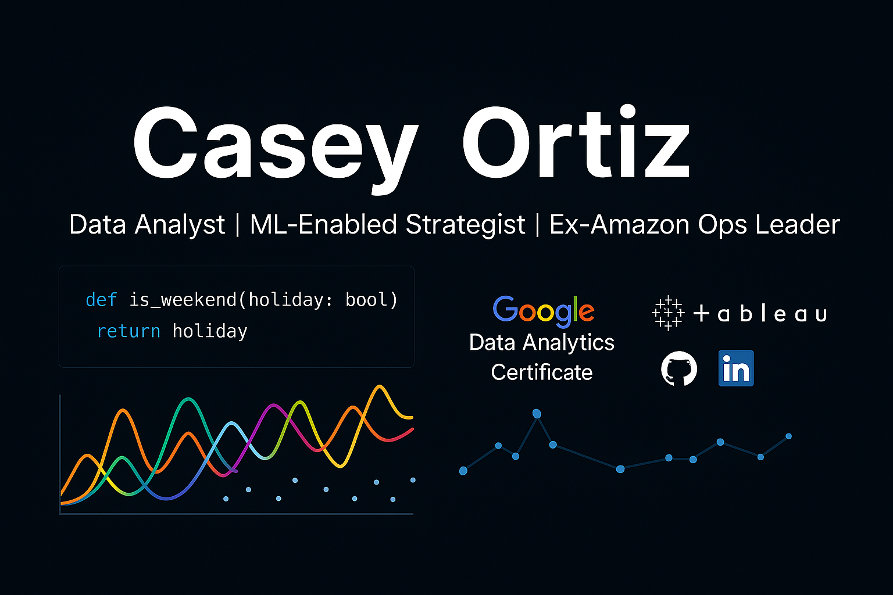

  

  <b>Data Analyst | UVA Darden MBA | ML-Enabled Strategist</b> 
  Annapolis, MD · kcarlos.ortiz@gmail.com · <a href="https://linkedin.com/in/kco1">LinkedIn</a>

---

### About Me

I'm a former Amazon and military operations leader pivoting into **data analytics and machine learning**. I bring 10+ years of experience building teams and driving high-stakes decisions — now powered by Python, R, and real-world data.

I've completed the Google Data Analytics Certificate and recently delivered full-scale analytics and ML projects in supply chain optimization, federal Health IT bidding, and insurance cost modeling. I love transforming messy data into meaningful, strategic insights.

---

### 🚀 Featured Projects

#### [Federal Health IT Bid Prediction](https://github.com/caseyio/federal-bid-prediction)
> *Analytics case study aligned to federal capture roles like DLH's Capture Manager I*

- Built a bid prediction model using 43,000+ historical contract awards (USAspending.gov)
- Combined R (data prep) and Python (XGBoost, SHAP, PDP++) for predictive modeling
- Deployed 2 Streamlit apps for real-world use by capture and proposal teams  
  ➤ [View App](https://ay7jcdeztbpknhyxxbn5h3.streamlit.app) | [Bid Range Tool](https://federal-healthit-bid-predictor-mzxes68t2cusms5kmjuyyr.streamlit.app)

#### [Supply Chain Delivery Prediction](https://github.com/caseyio/supply-chain-capstone)
> *Capstone project using classification to predict supply chain disruptions*

- Cleaned and transformed 10K+ rows using R (`dplyr`, `readr`)
- Built binary classification models (LogReg, Decision Tree, XGBoost)
- Visualized key insights with `ggplot2` and Python dashboards  
  ➤ [Kaggle Notebook]([https://www.kaggle.com/code/your-kaggle-notebook-link](https://www.kaggle.com/code/caseyortiz/supply-chain-delivery-analysis-r-python))

#### Insurance Cost Modeling (Kaggle – 2nd Place)
> *Advanced regression project with LightGBM and Optuna tuning*

- Used LightGBM + Optuna to achieve a 13% RMSLE improvement

---

### Tools & Technologies

| Category      | Tools |
|---------------|-------|
| **Languages** | Python, R, SQL |
| **ML & Stats**| scikit-learn, XGBoost, LightGBM, SHAP, Optuna |
| **Data Prep** | pandas, dplyr, janitor |
| **Visualization** | ggplot2, seaborn, matplotlib, Power BI, Tableau |
| **Other**     | GitHub, Streamlit, Excel, Agile, AWS (Ops context) |

---

### Certifications

- **Google Data Analytics Certificate** *(Completed May 2025)*  
- **Cornell Project Management Certificate**

---

### 📫 Contact

- 📧 kcarlos.ortiz@gmail.com  
- 🔗 [LinkedIn](https://linkedin.com/in/kco1)  
- 🔗 [Kaggle](https://www.kaggle.com/caseyortiz)  
- 🔗 [GitHub Projects](https://github.com/caseyio?tab=repositories)

---

  <i>"Turning messy data into meaningful insights."</i>

